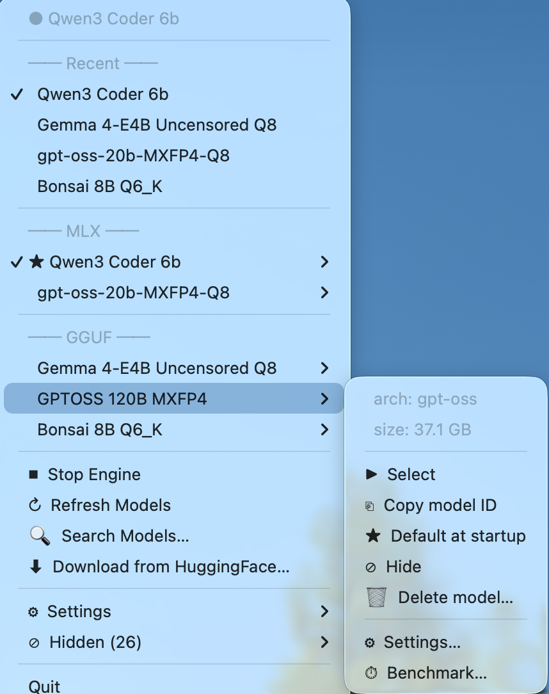
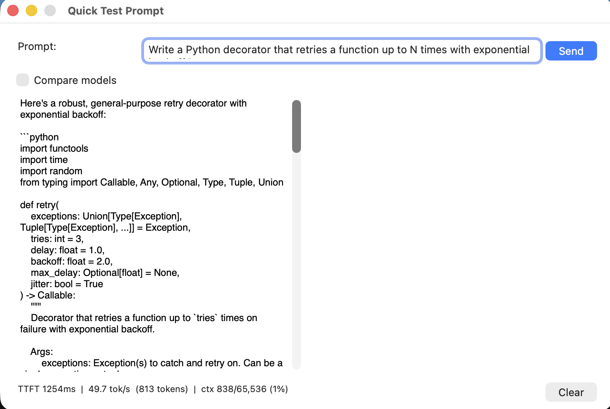
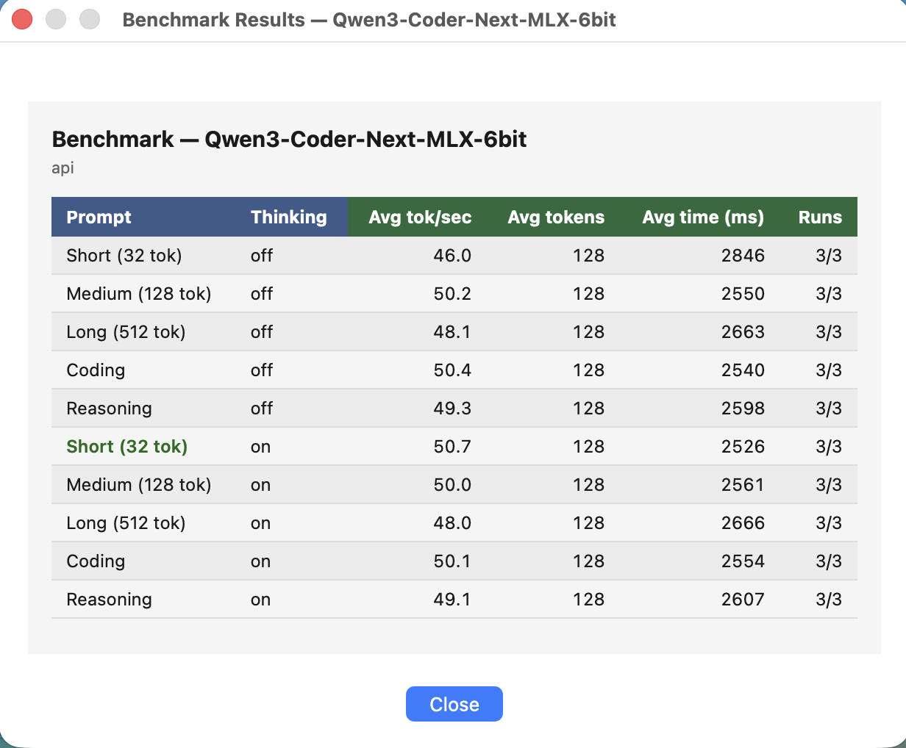
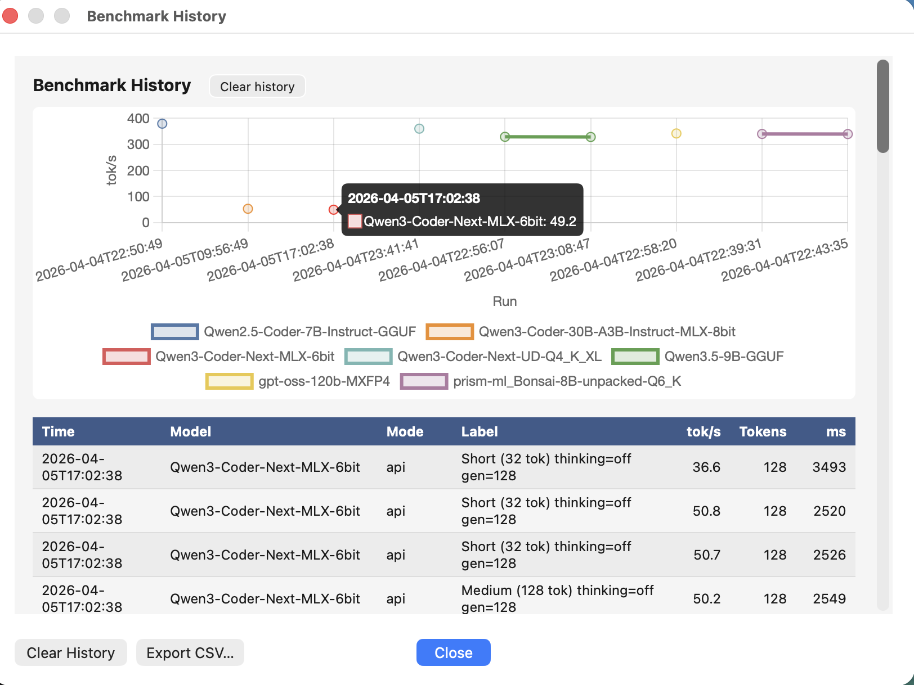

# Switchman

[](https://github.com/Buckeyes1995/switchman/actions/workflows/ci.yml)
[](LICENSE)
[](https://www.python.org/)
[]()

A macOS menu bar app for managing local LLM inference. Pick a model, it loads — no terminal, no config files, no fuss.

Supports **MLX** models via [oMLX](https://github.com/jmorganca/omlx) (Apple Silicon) and **GGUF** models via [llama.cpp](https://github.com/ggerganov/llama.cpp). Built with Python + rumps + PyObjC — no Electron, no web views, no cloud.

> Tested on M2 Max (96 GB), macOS 15. Apple Silicon required for MLX; GGUF works on any Mac.

---

<!-- screenshots -->





---

## Why Switchman?

Most local LLM tools are either full desktop apps (LM Studio, Ollama Desktop) or web UIs (Open WebUI). Switchman is neither — it lives in the menu bar and stays out of the way.

- **No web browser required** — everything is a native macOS panel
- **No Electron, no Node, no web server** — pure Python + PyObjC, ~15 MB installed
- **Unified MLX + GGUF** — both backends in one menu, same interface
- **llama-bench integration** — sweep batch sizes, cache types, and flash attention from a GUI; results saved to history with a Chart.js chart
- **Built for power users** — per-model sampling params, profiles, thinking mode, agent config sync, global hotkey

If you want a polished GUI with model discovery and a chat interface, use LM Studio. If you want a lightweight menu bar switch that gets out of your way while you work, this is for you.

---

## Core Features

- **One-click model switching** — MLX and GGUF in the same menu; cancels in-flight loads instantly
- **Live tokens/second + context meter** — `⚡ 42 t/s 14%ctx` updated every 10 seconds
- **Default model at startup** — auto-loads your preferred model on every launch
- **Download from HuggingFace** — search, preview size, and download with real-time MB/s progress; resumes interrupted downloads automatically
- **Quick model search** — floating search panel with type-to-filter and keyboard navigation
- **Quick Test Prompt** — stream responses with TTFT, tok/s, and context stats; side-by-side compare mode
- **Benchmarking** — API benchmark (any model) and full llama-bench parameter sweeps (GGUF)
- **Benchmark history** — interactive Chart.js bar chart with CSV export
- **Per-model settings** — context, tokens, temperature, penalties, GPU layers, thinking mode, sampling presets
- **Server crash watchdog** — detects and notifies on unexpected server death

## Additional Features

- **Model deletion** — delete a model from disk directly from the menu with confirmation
- **Disk space indicator** — shows free space on destination volume before downloading
- **Profiles** — save and apply parameter sets across models in one click
- **Memory pressure indicator** — 🟢/🟡/🔴 badge; shown in menu bar when critical
- **Model notes & aliases** — annotate or rename any model without touching files
- **Hide / unhide models** — declutter the menu without deleting anything
- **Recent models** — last 5 selections pinned to the top of the menu
- **Copy model ID** — copies `omlx/ModelName` for use in any OpenAI-compatible client
- **Global hotkey ⌥Space** — open the menu from anywhere (requires Accessibility permission)
- **macOS notifications** — fires when a model loads or a server crashes
- **opencode / Cursor / Continue.dev sync** *(optional)* — keeps coding agent configs in sync on every switch

---

## Quick Start

```bash
git clone https://github.com/Buckeyes1995/switchman.git ~/projects/switchman
bash ~/projects/switchman/run.sh
```

First run creates `.venv/` and installs all dependencies. A `⚡` icon appears in your menu bar.

1. Click `⚡` → **⚙ Settings → Open Settings…**
2. Set your **MLX models directory** and/or **GGUF models directory**
3. Set paths to **oMLX** and/or **llama-server** binaries
4. Click **Save** → **↻ Refresh Models**

No models yet? Use **⬇ Download from HuggingFace…** to grab one first.

---

## Documentation

| | |
|---|---|
| [Installation](docs/installation.md) | Requirements, venv setup, launchd autostart |
| [Configuration](docs/configuration.md) | Config file reference, model directory layout |
| [Features](docs/features.md) | Full feature reference with all options |
| [Development](docs/development.md) | Architecture, threading model, dev workflow |

---

## Roadmap

See [ROADMAP.md](ROADMAP.md) for planned features, known issues, and the ideas parking lot.

---

## Contributing

See [CONTRIBUTING.md](CONTRIBUTING.md). PRs welcome — please read it before submitting.

---

## License

[MIT](LICENSE)
